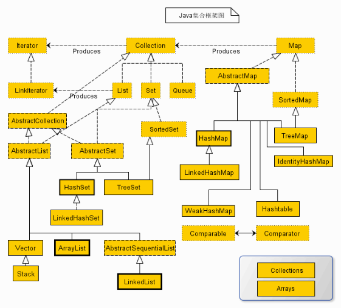

[返回大纲](./index.md)
# 一、Java基础

## 1. 面向对象与面向过程的区别，举个例子说明一下
面向过程：分析解决问题的步骤，每个步骤代表一个函数，连续调用即可；性能高。  
面向对象：把构成问题的事物分解成多个对象，而建立对象目的不是为了完成一个个步骤，而是为了描述某个事物在解决问题的过程中所发生的行为。面向对象有抽象、封装、继承、多态的特性，所以易复用、易扩展、易维护。有利于构建低耦合的系统。  
最大的区别是，是否面向抽象编程。  
举例：  
## 2. hashcode 的作用
根据内存对象地址换算出的一个值，hashcode不同，对象不等；hashcode相等，对象不一定相等；  
hash存在碰撞，解决hash冲突的方法：开发寻址法、链地址法、再hash法。
## 3. 基本数据类型
Integer 可枚举，所以可以设置缓存，默认是[-128,127]
## 4. 四种引用，强软弱虚
强，OOM不会回收  
软，内存不足时，OOM，JVM回收  
弱，GC 直接回收  
虚，回收之前，会被放入ReferenceQueue中，其他引用会在JVM回收后，放入ReferenceQueue中，所以虚引用大多用于引用销毁前的处理工作。  
## 5. a=a+b与a+=b有什么区别
前者不会隐式类型转换，后者会将结果隐式转换为a。
## 6. try catch finally，try里面retrun，finally 中还执行吗
finally还执行，在return 之前执行。  
1. 如果return 返回的是对象引用，finally中修改，会影响return 的值
2. 如果return 返回的是基本类型，finally中修改，不会影响return 的值
## 7. OOM你遇到过哪些情况，SOF你遇到过哪些情况
OOM：OutOfMemoryError，内存溢出，除了程序计数器不会发生，其他区域都会发生OOM。  
1. Java Heap 溢出：堆存储对象实例，对象多，且GC Roots可达，数据量最大堆容量就会发生OOM。  
解决方法：开启内存堆转储快照dump功能，通过内存分析工具进行分析，重点是分析对象是否是必要的，主要是分清内存泄漏还是内存溢出。  
内存泄漏：可以通过内存工具进一步看泄漏对象到GCRoots的引用链，于是可以发现泄漏对象是通过怎样的路径导致JVM无法自动回收的，进行代码的优化。  
如果不存在内存泄漏，检查堆内存大小的设置(-Xmx 和 -Xms) 
2. Java 栈溢出：虚拟机栈或本地方法栈中存储栈帧，如果线程请求的栈深度大于虚拟机允许的最大深度，抛出SOF（StackOverflowError）。  
如果虚拟机在扩展栈时无法申请足够的内存空间，抛出OOM异常  
注意：栈的大小越大，可分配的线程数就越少
3. 运行时常量区溢出：PermGenspace
4. 方法区溢出：方法区用于存储Class 相关信息，如类名、访问修饰符、常量池、字段描述符、方法描述等
## 8. 什么是反射
运行时，获取类的所有属性和方法；调用对象的任意方法，这种能力称之为反射；  
JDBC 就是典型，Class.forName('com.mysql.jdbc.Driver')

## 二、集合

### 2.1 集合异同点
|集合类型|空值|重复|有序|线程安全|扩容|备注|
|---|---|---|---|---|---|---|
|CopyOnWriteArrayList|是|是|是|是|0.5n|写时复制，线程安全，数据最终一致性|
|HashMap|是|否|否|否|2n||

### 2.2 HashMap 在高并发情况下会出现什么问题
1. 数据丢失
2. 数组扩容

### 2.3 

## 三、IO/NIO
### 3.1 IO 的类型
1. 流向：输入流/输出流
2. 操作单元：字节流/字符流
3. 处理节点：节点流/处理流

### 3.2 IO 和 NIO 的区别与联系
参考：https://mp.weixin.qq.com/s/N1ojvByYmary65B6JM1ZWA

